# Experiment path : results/baseline_mlp/

## Model info 
- **model_name**:
  BaselineMLP
- **model_summary**:
  BaselineMLP(
  (lin_0): Linear(in_features=784, out_features=256, bias=True)
  (act_0): ReLU()
  (lin_1): Linear(in_features=256, out_features=128, bias=True)
  (act_1): ReLU()
  (lin_2): Linear(in_features=128, out_features=10, bias=True)
)
- **model_modules**:
  - 
    - **name**:
      lin_0
    - **module**:
      Linear(in_features=784, out_features=256, bias=True)
  - 
    - **name**:
      act_0
    - **module**:
      ReLU()
  - 
    - **name**:
      lin_1
    - **module**:
      Linear(in_features=256, out_features=128, bias=True)
  - 
    - **name**:
      act_1
    - **module**:
      ReLU()
  - 
    - **name**:
      lin_2
    - **module**:
      Linear(in_features=128, out_features=10, bias=True)
- **model_parameters**:
  - 
    - **name**:
      lin_0.weight
    - **parameters_count**:
      200704
    - **parameters_shape**:
      - 
        256
      - 
        784
  - 
    - **name**:
      lin_0.bias
    - **parameters_count**:
      256
    - **parameters_shape**:
      - 
        256
  - 
    - **name**:
      lin_1.weight
    - **parameters_count**:
      32768
    - **parameters_shape**:
      - 
        128
      - 
        256
  - 
    - **name**:
      lin_1.bias
    - **parameters_count**:
      128
    - **parameters_shape**:
      - 
        128
  - 
    - **name**:
      lin_2.weight
    - **parameters_count**:
      1280
    - **parameters_shape**:
      - 
        10
      - 
        128
  - 
    - **name**:
      lin_2.bias
    - **parameters_count**:
      10
    - **parameters_shape**:
      - 
        10

## Training Results

### Summary

| Metric | Value |
|---|---|
| Accuracy | 0.99750 |
| Precision | 0.99748 |
| Recall | 0.99748 |
| F1 | 0.99748 |

### Per Class Metrics

| Class | TP | TN | FP | FN | Support | Accuracy | Precision | Recall | F1 |
|---|---|---|---|---|---|---|---|---|---|
| 0 | 5891 | 54095 | 8 | 6 | 5897 | 0.99898 | 0.99864 | 0.99898 | 0.99881 |
| 1 | 6763 | 53219 | 10 | 8 | 6771 | 0.99882 | 0.99852 | 0.99882 | 0.99867 |
| 2 | 5873 | 54090 | 19 | 18 | 5891 | 0.99694 | 0.99678 | 0.99694 | 0.99686 |
| 3 | 6090 | 53872 | 17 | 21 | 6111 | 0.99656 | 0.99722 | 0.99656 | 0.99689 |
| 4 | 5760 | 54219 | 11 | 10 | 5770 | 0.99827 | 0.99809 | 0.99827 | 0.99818 |
| 5 | 5395 | 54568 | 19 | 18 | 5413 | 0.99667 | 0.99649 | 0.99667 | 0.99658 |
| 6 | 5980 | 53994 | 12 | 14 | 5994 | 0.99766 | 0.99800 | 0.99766 | 0.99783 |
| 7 | 6202 | 53773 | 13 | 12 | 6214 | 0.99807 | 0.99791 | 0.99807 | 0.99799 |
| 8 | 5972 | 53990 | 20 | 18 | 5990 | 0.99699 | 0.99666 | 0.99699 | 0.99683 |
| 9 | 5924 | 54030 | 21 | 25 | 5949 | 0.99580 | 0.99647 | 0.99580 | 0.99613 |

### Confusion Matrix

| Actual \ Pred | 0 | 1 | 2 | 3 | 4 | 5 | 6 | 7 | 8 | 9 |
|---|---|---|---|---|---|---|---|---|---|---|
| 0 | 5891 | 0 | 2 | 0 | 0 | 1 | 0 | 1 | 0 | 2 |
| 1 | 0 | 6763 | 1 | 0 | 0 | 1 | 1 | 0 | 5 | 0 |
| 2 | 5 | 0 | 5873 | 3 | 2 | 0 | 1 | 5 | 2 | 0 |
| 3 | 0 | 0 | 8 | 6090 | 0 | 8 | 0 | 1 | 2 | 2 |
| 4 | 0 | 1 | 1 | 0 | 5760 | 0 | 2 | 0 | 0 | 6 |
| 5 | 1 | 1 | 0 | 7 | 0 | 5395 | 7 | 0 | 1 | 1 |
| 6 | 1 | 1 | 2 | 0 | 2 | 6 | 5980 | 0 | 1 | 1 |
| 7 | 1 | 2 | 2 | 1 | 0 | 1 | 0 | 6202 | 1 | 4 |
| 8 | 0 | 4 | 3 | 4 | 0 | 1 | 1 | 0 | 5972 | 5 |
| 9 | 0 | 1 | 0 | 2 | 7 | 1 | 0 | 6 | 8 | 5924 |

## Testing Results

### Summary

| Metric | Value |
|---|---|
| Accuracy | 0.98067 |
| Precision | 0.98049 |
| Recall | 0.98073 |
| F1 | 0.98059 |

### Per Class Metrics

| Class | TP | TN | FP | FN | Support | Accuracy | Precision | Recall | F1 |
|---|---|---|---|---|---|---|---|---|---|
| 0 | 925 | 9035 | 18 | 6 | 931 | 0.99356 | 0.98091 | 0.99356 | 0.98719 |
| 1 | 1103 | 8862 | 10 | 9 | 1112 | 0.99191 | 0.99102 | 0.99191 | 0.99146 |
| 2 | 1014 | 8929 | 24 | 17 | 1031 | 0.98351 | 0.97688 | 0.98351 | 0.98018 |
| 3 | 1027 | 8917 | 11 | 29 | 1056 | 0.97254 | 0.98940 | 0.97254 | 0.98090 |
| 4 | 1002 | 8931 | 19 | 32 | 1034 | 0.96905 | 0.98139 | 0.96905 | 0.97518 |
| 5 | 925 | 9026 | 23 | 10 | 935 | 0.98930 | 0.97574 | 0.98930 | 0.98247 |
| 6 | 907 | 9043 | 16 | 18 | 925 | 0.98054 | 0.98267 | 0.98054 | 0.98160 |
| 7 | 958 | 8980 | 25 | 21 | 979 | 0.97855 | 0.97457 | 0.97855 | 0.97655 |
| 8 | 924 | 9010 | 24 | 26 | 950 | 0.97263 | 0.97468 | 0.97263 | 0.97366 |
| 9 | 1006 | 8930 | 23 | 25 | 1031 | 0.97575 | 0.97765 | 0.97575 | 0.97670 |

### Confusion Matrix

| Actual \ Pred | 0 | 1 | 2 | 3 | 4 | 5 | 6 | 7 | 8 | 9 |
|---|---|---|---|---|---|---|---|---|---|---|
| 0 | 925 | 1 | 0 | 0 | 0 | 1 | 2 | 2 | 0 | 0 |
| 1 | 0 | 1103 | 0 | 2 | 0 | 1 | 2 | 0 | 4 | 0 |
| 2 | 2 | 0 | 1014 | 5 | 1 | 0 | 1 | 6 | 2 | 0 |
| 3 | 0 | 0 | 8 | 1027 | 0 | 17 | 0 | 2 | 2 | 0 |
| 4 | 3 | 0 | 0 | 0 | 1002 | 0 | 6 | 4 | 2 | 17 |
| 5 | 1 | 0 | 0 | 1 | 0 | 925 | 4 | 0 | 3 | 1 |
| 6 | 4 | 2 | 0 | 0 | 8 | 2 | 907 | 0 | 2 | 0 |
| 7 | 0 | 3 | 13 | 0 | 0 | 0 | 0 | 958 | 2 | 3 |
| 8 | 7 | 0 | 3 | 1 | 5 | 1 | 1 | 6 | 924 | 2 |
| 9 | 1 | 4 | 0 | 2 | 5 | 1 | 0 | 5 | 7 | 1006 |

## Quantization scheme

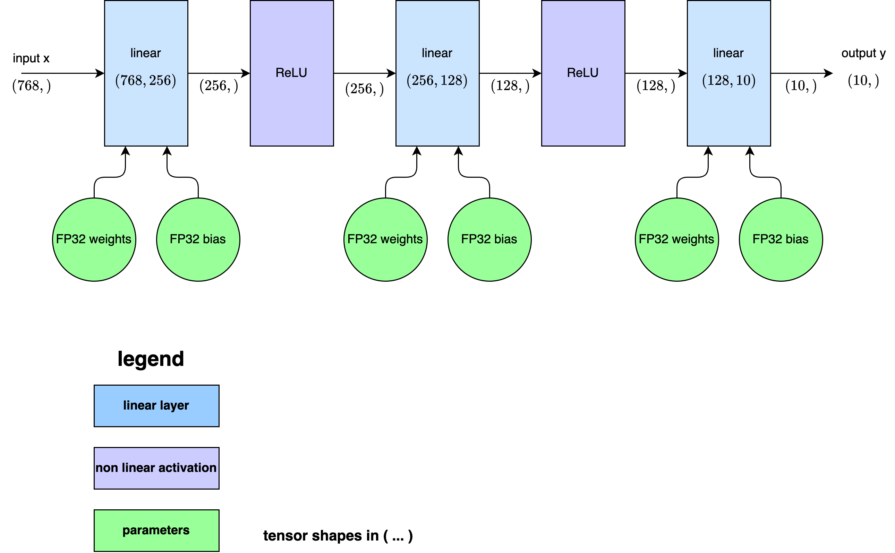

## Result plots

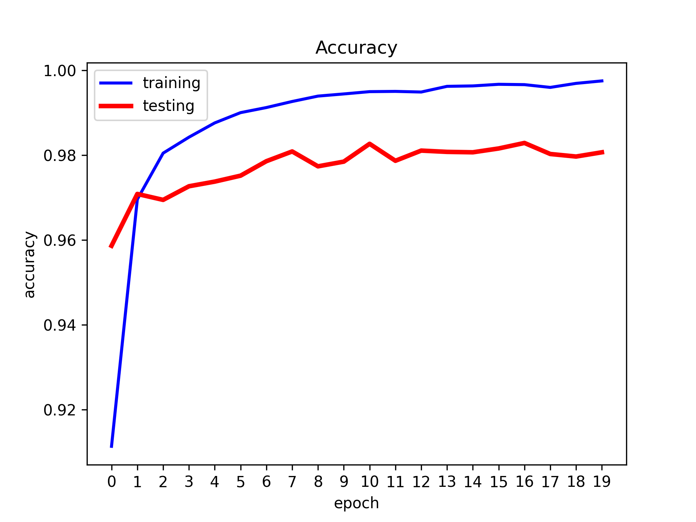

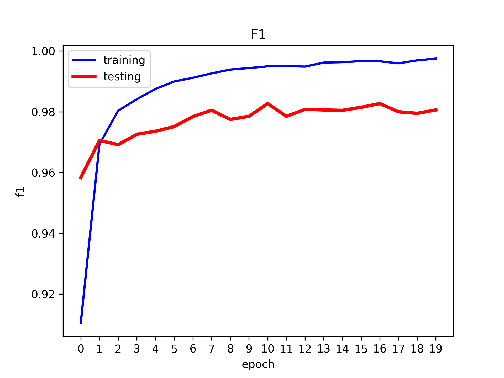

## Weights distribution

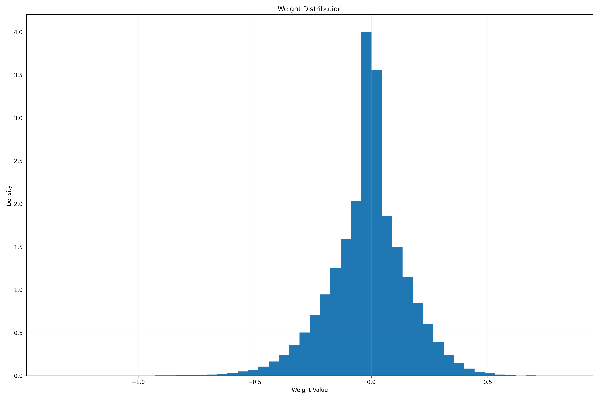

# Model comparison

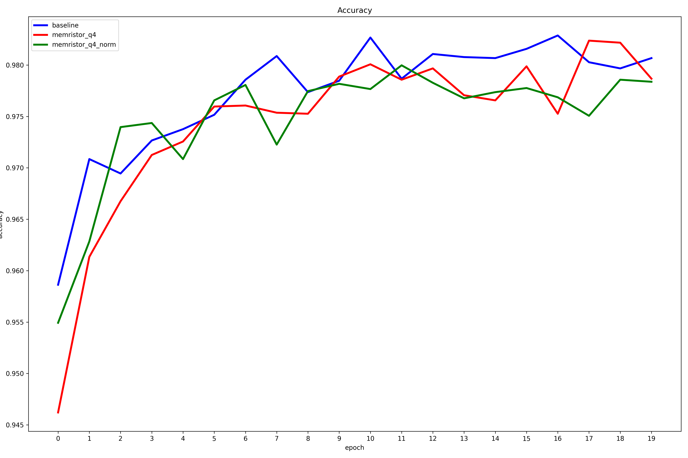

# Experiment path : results/memristor_q4_mlp/

## Model info 
- **model_name**:
  MemristorMLP
- **model_summary**:
  MemristorMLP(
  (lin_0): MemristorLinear()
  (act_0): ReLU()
  (lin_1): MemristorLinear()
  (act_1): ReLU()
  (lin_2): MemristorLinear()
)
- **model_modules**:
  - 
    - **name**:
      lin_0
    - **module**:
      MemristorLinear()
  - 
    - **name**:
      act_0
    - **module**:
      ReLU()
  - 
    - **name**:
      lin_1
    - **module**:
      MemristorLinear()
  - 
    - **name**:
      act_1
    - **module**:
      ReLU()
  - 
    - **name**:
      lin_2
    - **module**:
      MemristorLinear()
- **model_parameters**:
  - 
    - **name**:
      lin_0.p_pos
    - **parameters_count**:
      200704
    - **parameters_shape**:
      - 
        256
      - 
        784
  - 
    - **name**:
      lin_0.p_neg
    - **parameters_count**:
      200704
    - **parameters_shape**:
      - 
        256
      - 
        784
  - 
    - **name**:
      lin_0.bias
    - **parameters_count**:
      256
    - **parameters_shape**:
      - 
        256
  - 
    - **name**:
      lin_1.p_pos
    - **parameters_count**:
      32768
    - **parameters_shape**:
      - 
        128
      - 
        256
  - 
    - **name**:
      lin_1.p_neg
    - **parameters_count**:
      32768
    - **parameters_shape**:
      - 
        128
      - 
        256
  - 
    - **name**:
      lin_1.bias
    - **parameters_count**:
      128
    - **parameters_shape**:
      - 
        128
  - 
    - **name**:
      lin_2.p_pos
    - **parameters_count**:
      1280
    - **parameters_shape**:
      - 
        10
      - 
        128
  - 
    - **name**:
      lin_2.p_neg
    - **parameters_count**:
      1280
    - **parameters_shape**:
      - 
        10
      - 
        128
  - 
    - **name**:
      lin_2.bias
    - **parameters_count**:
      10
    - **parameters_shape**:
      - 
        10

## Training Results

### Summary

| Metric | Value |
|---|---|
| Accuracy | 0.99750 |
| Precision | 0.99749 |
| Recall | 0.99749 |
| F1 | 0.99749 |

### Per Class Metrics

| Class | TP | TN | FP | FN | Support | Accuracy | Precision | Recall | F1 |
|---|---|---|---|---|---|---|---|---|---|
| 0 | 5934 | 54056 | 5 | 5 | 5939 | 0.99916 | 0.99916 | 0.99916 | 0.99916 |
| 1 | 6610 | 53368 | 10 | 12 | 6622 | 0.99819 | 0.99849 | 0.99819 | 0.99834 |
| 2 | 5915 | 54066 | 9 | 10 | 5925 | 0.99831 | 0.99848 | 0.99831 | 0.99840 |
| 3 | 6131 | 53828 | 18 | 23 | 6154 | 0.99626 | 0.99707 | 0.99626 | 0.99667 |
| 4 | 5781 | 54189 | 11 | 19 | 5800 | 0.99672 | 0.99810 | 0.99672 | 0.99741 |
| 5 | 5563 | 54402 | 17 | 18 | 5581 | 0.99677 | 0.99695 | 0.99677 | 0.99686 |
| 6 | 5929 | 54047 | 13 | 11 | 5940 | 0.99815 | 0.99781 | 0.99815 | 0.99798 |
| 7 | 6231 | 53738 | 17 | 14 | 6245 | 0.99776 | 0.99728 | 0.99776 | 0.99752 |
| 8 | 5854 | 54110 | 21 | 15 | 5869 | 0.99744 | 0.99643 | 0.99744 | 0.99693 |
| 9 | 5902 | 54046 | 29 | 23 | 5925 | 0.99612 | 0.99511 | 0.99612 | 0.99561 |

### Confusion Matrix

| Actual \ Pred | 0 | 1 | 2 | 3 | 4 | 5 | 6 | 7 | 8 | 9 |
|---|---|---|---|---|---|---|---|---|---|---|
| 0 | 5934 | 0 | 0 | 0 | 0 | 1 | 1 | 0 | 0 | 3 |
| 1 | 0 | 6610 | 0 | 1 | 2 | 0 | 2 | 3 | 3 | 1 |
| 2 | 1 | 1 | 5915 | 2 | 1 | 0 | 0 | 3 | 2 | 0 |
| 3 | 0 | 1 | 4 | 6131 | 0 | 7 | 0 | 1 | 6 | 4 |
| 4 | 0 | 1 | 1 | 0 | 5781 | 0 | 2 | 4 | 0 | 11 |
| 5 | 0 | 0 | 0 | 7 | 0 | 5563 | 6 | 0 | 4 | 1 |
| 6 | 1 | 1 | 0 | 0 | 1 | 5 | 5929 | 0 | 3 | 0 |
| 7 | 0 | 2 | 2 | 1 | 1 | 0 | 0 | 6231 | 1 | 7 |
| 8 | 0 | 3 | 2 | 2 | 0 | 4 | 2 | 0 | 5854 | 2 |
| 9 | 3 | 1 | 0 | 5 | 6 | 0 | 0 | 6 | 2 | 5902 |

## Testing Results

### Summary

| Metric | Value |
|---|---|
| Accuracy | 0.97867 |
| Precision | 0.97891 |
| Recall | 0.97816 |
| F1 | 0.97847 |

### Per Class Metrics

| Class | TP | TN | FP | FN | Support | Accuracy | Precision | Recall | F1 |
|---|---|---|---|---|---|---|---|---|---|
| 0 | 955 | 9010 | 16 | 3 | 958 | 0.99687 | 0.98352 | 0.99687 | 0.99015 |
| 1 | 1167 | 8786 | 24 | 7 | 1174 | 0.99404 | 0.97985 | 0.99404 | 0.98689 |
| 2 | 996 | 8939 | 26 | 23 | 1019 | 0.97743 | 0.97456 | 0.97743 | 0.97599 |
| 3 | 1001 | 8942 | 24 | 17 | 1018 | 0.98330 | 0.97659 | 0.98330 | 0.97993 |
| 4 | 975 | 8969 | 25 | 15 | 990 | 0.98485 | 0.97500 | 0.98485 | 0.97990 |
| 5 | 802 | 9136 | 21 | 25 | 827 | 0.96977 | 0.97448 | 0.96977 | 0.97212 |
| 6 | 910 | 9036 | 4 | 34 | 944 | 0.96398 | 0.99562 | 0.96398 | 0.97955 |
| 7 | 1014 | 8923 | 24 | 23 | 1037 | 0.97782 | 0.97688 | 0.97782 | 0.97735 |
| 8 | 904 | 9028 | 13 | 39 | 943 | 0.95864 | 0.98582 | 0.95864 | 0.97204 |
| 9 | 1047 | 8874 | 36 | 27 | 1074 | 0.97486 | 0.96676 | 0.97486 | 0.97079 |

### Confusion Matrix

| Actual \ Pred | 0 | 1 | 2 | 3 | 4 | 5 | 6 | 7 | 8 | 9 |
|---|---|---|---|---|---|---|---|---|---|---|
| 0 | 955 | 0 | 2 | 0 | 0 | 0 | 1 | 0 | 0 | 0 |
| 1 | 0 | 1167 | 4 | 0 | 0 | 2 | 0 | 0 | 1 | 0 |
| 2 | 2 | 4 | 996 | 0 | 3 | 0 | 0 | 9 | 4 | 1 |
| 3 | 0 | 0 | 4 | 1001 | 0 | 2 | 0 | 3 | 3 | 5 |
| 4 | 0 | 4 | 3 | 0 | 975 | 0 | 0 | 0 | 0 | 8 |
| 5 | 3 | 0 | 0 | 11 | 0 | 802 | 1 | 3 | 1 | 6 |
| 6 | 3 | 1 | 6 | 0 | 11 | 11 | 910 | 0 | 2 | 0 |
| 7 | 0 | 10 | 5 | 0 | 0 | 0 | 1 | 1014 | 1 | 6 |
| 8 | 5 | 0 | 2 | 7 | 3 | 6 | 1 | 5 | 904 | 10 |
| 9 | 3 | 5 | 0 | 6 | 8 | 0 | 0 | 4 | 1 | 1047 |

## Quantization scheme

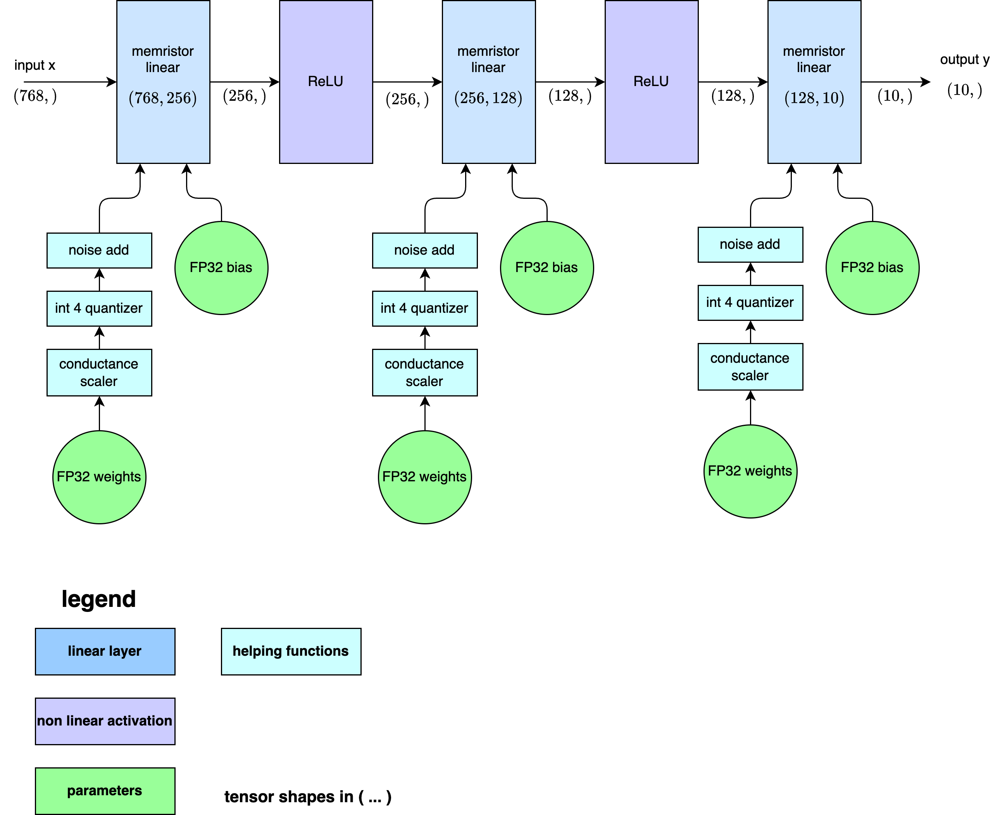

## Result plots

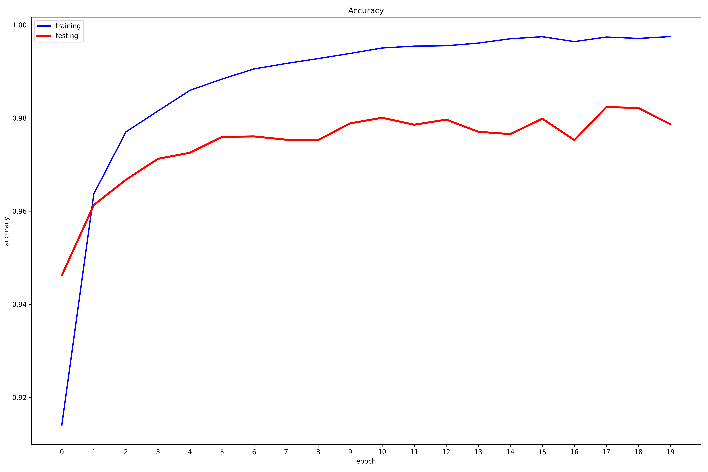

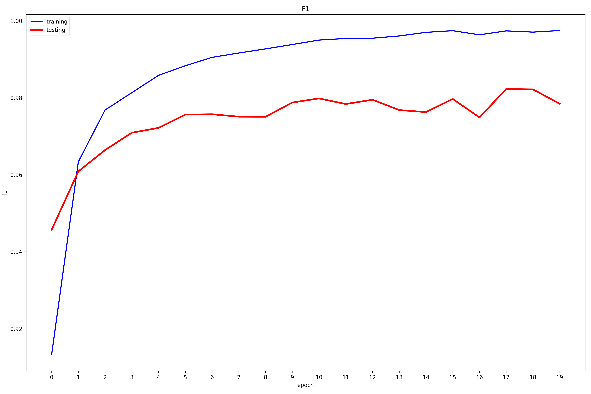

## Weights distribution

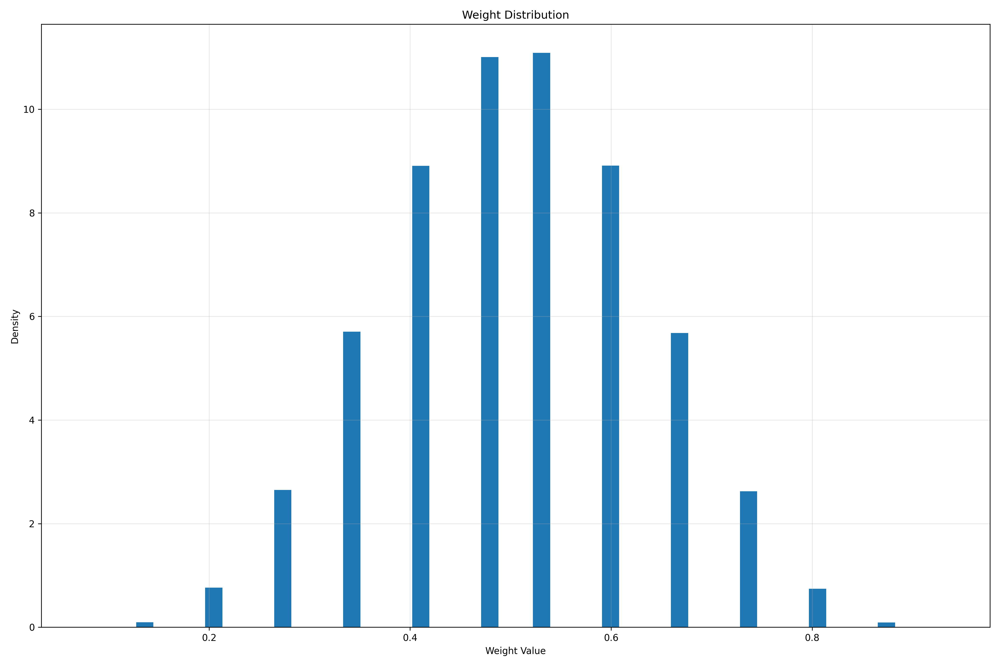

# Model comparison

# Experiment path : results/memristor_q4_norm_mlp/

## Model info 
- **model_name**:
  MemristorMLPNorm
- **model_summary**:
  MemristorMLPNorm(
  (norm_0): LayerNorm((784,), eps=1e-05, elementwise_affine=True)
  (lin_0): MemristorLinear()
  (act_0): ReLU()
  (norm_1): LayerNorm((256,), eps=1e-05, elementwise_affine=True)
  (lin_1): MemristorLinear()
  (act_1): ReLU()
  (norm_2): LayerNorm((128,), eps=1e-05, elementwise_affine=True)
  (lin_2): MemristorLinear()
)
- **model_modules**:
  - 
    - **name**:
      norm_0
    - **module**:
      LayerNorm((784,), eps=1e-05, elementwise_affine=True)
  - 
    - **name**:
      lin_0
    - **module**:
      MemristorLinear()
  - 
    - **name**:
      act_0
    - **module**:
      ReLU()
  - 
    - **name**:
      norm_1
    - **module**:
      LayerNorm((256,), eps=1e-05, elementwise_affine=True)
  - 
    - **name**:
      lin_1
    - **module**:
      MemristorLinear()
  - 
    - **name**:
      act_1
    - **module**:
      ReLU()
  - 
    - **name**:
      norm_2
    - **module**:
      LayerNorm((128,), eps=1e-05, elementwise_affine=True)
  - 
    - **name**:
      lin_2
    - **module**:
      MemristorLinear()
- **model_parameters**:
  - 
    - **name**:
      norm_0.weight
    - **parameters_count**:
      784
    - **parameters_shape**:
      - 
        784
  - 
    - **name**:
      norm_0.bias
    - **parameters_count**:
      784
    - **parameters_shape**:
      - 
        784
  - 
    - **name**:
      lin_0.p_pos
    - **parameters_count**:
      200704
    - **parameters_shape**:
      - 
        256
      - 
        784
  - 
    - **name**:
      lin_0.p_neg
    - **parameters_count**:
      200704
    - **parameters_shape**:
      - 
        256
      - 
        784
  - 
    - **name**:
      lin_0.bias
    - **parameters_count**:
      256
    - **parameters_shape**:
      - 
        256
  - 
    - **name**:
      norm_1.weight
    - **parameters_count**:
      256
    - **parameters_shape**:
      - 
        256
  - 
    - **name**:
      norm_1.bias
    - **parameters_count**:
      256
    - **parameters_shape**:
      - 
        256
  - 
    - **name**:
      lin_1.p_pos
    - **parameters_count**:
      32768
    - **parameters_shape**:
      - 
        128
      - 
        256
  - 
    - **name**:
      lin_1.p_neg
    - **parameters_count**:
      32768
    - **parameters_shape**:
      - 
        128
      - 
        256
  - 
    - **name**:
      lin_1.bias
    - **parameters_count**:
      128
    - **parameters_shape**:
      - 
        128
  - 
    - **name**:
      norm_2.weight
    - **parameters_count**:
      128
    - **parameters_shape**:
      - 
        128
  - 
    - **name**:
      norm_2.bias
    - **parameters_count**:
      128
    - **parameters_shape**:
      - 
        128
  - 
    - **name**:
      lin_2.p_pos
    - **parameters_count**:
      1280
    - **parameters_shape**:
      - 
        10
      - 
        128
  - 
    - **name**:
      lin_2.p_neg
    - **parameters_count**:
      1280
    - **parameters_shape**:
      - 
        10
      - 
        128
  - 
    - **name**:
      lin_2.bias
    - **parameters_count**:
      10
    - **parameters_shape**:
      - 
        10

## Training Results

### Summary

| Metric | Value |
|---|---|
| Accuracy | 0.99838 |
| Precision | 0.99837 |
| Recall | 0.99836 |
| F1 | 0.99837 |

### Per Class Metrics

| Class | TP | TN | FP | FN | Support | Accuracy | Precision | Recall | F1 |
|---|---|---|---|---|---|---|---|---|---|
| 0 | 5966 | 54024 | 4 | 6 | 5972 | 0.99900 | 0.99933 | 0.99900 | 0.99916 |
| 1 | 6660 | 53337 | 2 | 1 | 6661 | 0.99985 | 0.99970 | 0.99985 | 0.99977 |
| 2 | 5897 | 54087 | 8 | 8 | 5905 | 0.99865 | 0.99865 | 0.99865 | 0.99865 |
| 3 | 6047 | 53936 | 5 | 12 | 6059 | 0.99802 | 0.99917 | 0.99802 | 0.99860 |
| 4 | 5934 | 54031 | 17 | 18 | 5952 | 0.99698 | 0.99714 | 0.99698 | 0.99706 |
| 5 | 5414 | 54567 | 8 | 11 | 5425 | 0.99797 | 0.99852 | 0.99797 | 0.99825 |
| 6 | 5843 | 54135 | 14 | 8 | 5851 | 0.99863 | 0.99761 | 0.99863 | 0.99812 |
| 7 | 6240 | 53740 | 13 | 7 | 6247 | 0.99888 | 0.99792 | 0.99888 | 0.99840 |
| 8 | 5945 | 54037 | 11 | 7 | 5952 | 0.99882 | 0.99815 | 0.99882 | 0.99849 |
| 9 | 5957 | 54009 | 15 | 19 | 5976 | 0.99682 | 0.99749 | 0.99682 | 0.99715 |

### Confusion Matrix

| Actual \ Pred | 0 | 1 | 2 | 3 | 4 | 5 | 6 | 7 | 8 | 9 |
|---|---|---|---|---|---|---|---|---|---|---|
| 0 | 5966 | 0 | 2 | 0 | 0 | 0 | 2 | 1 | 1 | 0 |
| 1 | 0 | 6660 | 0 | 0 | 0 | 0 | 0 | 1 | 0 | 0 |
| 2 | 1 | 0 | 5897 | 1 | 0 | 0 | 0 | 2 | 3 | 1 |
| 3 | 0 | 0 | 4 | 6047 | 0 | 5 | 0 | 0 | 2 | 1 |
| 4 | 1 | 0 | 0 | 0 | 5934 | 0 | 7 | 2 | 0 | 8 |
| 5 | 1 | 0 | 0 | 3 | 1 | 5414 | 1 | 1 | 3 | 1 |
| 6 | 1 | 0 | 0 | 0 | 6 | 0 | 5843 | 0 | 1 | 0 |
| 7 | 0 | 1 | 1 | 1 | 0 | 0 | 1 | 6240 | 0 | 3 |
| 8 | 0 | 1 | 1 | 0 | 0 | 2 | 2 | 0 | 5945 | 1 |
| 9 | 0 | 0 | 0 | 0 | 10 | 1 | 1 | 6 | 1 | 5957 |

## Testing Results

### Summary

| Metric | Value |
|---|---|
| Accuracy | 0.97837 |
| Precision | 0.97804 |
| Recall | 0.97817 |
| F1 | 0.97807 |

### Per Class Metrics

| Class | TP | TN | FP | FN | Support | Accuracy | Precision | Recall | F1 |
|---|---|---|---|---|---|---|---|---|---|
| 0 | 991 | 8969 | 18 | 6 | 997 | 0.99398 | 0.98216 | 0.99398 | 0.98804 |
| 1 | 1138 | 8824 | 6 | 16 | 1154 | 0.98614 | 0.99476 | 0.98614 | 0.99043 |
| 2 | 1027 | 8925 | 17 | 15 | 1042 | 0.98560 | 0.98372 | 0.98560 | 0.98466 |
| 3 | 992 | 8947 | 31 | 14 | 1006 | 0.98608 | 0.96970 | 0.98608 | 0.97782 |
| 4 | 925 | 9010 | 18 | 31 | 956 | 0.96757 | 0.98091 | 0.96757 | 0.97420 |
| 5 | 873 | 9069 | 20 | 22 | 895 | 0.97542 | 0.97760 | 0.97542 | 0.97651 |
| 6 | 968 | 8968 | 31 | 17 | 985 | 0.98274 | 0.96897 | 0.98274 | 0.97581 |
| 7 | 1010 | 8916 | 17 | 41 | 1051 | 0.96099 | 0.98345 | 0.96099 | 0.97209 |
| 8 | 915 | 9021 | 23 | 25 | 940 | 0.97340 | 0.97548 | 0.97340 | 0.97444 |
| 9 | 929 | 8991 | 35 | 29 | 958 | 0.96973 | 0.96369 | 0.96973 | 0.96670 |

### Confusion Matrix

| Actual \ Pred | 0 | 1 | 2 | 3 | 4 | 5 | 6 | 7 | 8 | 9 |
|---|---|---|---|---|---|---|---|---|---|---|
| 0 | 991 | 0 | 0 | 0 | 0 | 1 | 4 | 1 | 0 | 0 |
| 1 | 4 | 1138 | 1 | 2 | 0 | 0 | 2 | 1 | 6 | 0 |
| 2 | 2 | 1 | 1027 | 2 | 1 | 0 | 2 | 3 | 4 | 0 |
| 3 | 0 | 1 | 1 | 992 | 0 | 2 | 0 | 4 | 5 | 1 |
| 4 | 3 | 0 | 4 | 0 | 925 | 0 | 5 | 0 | 1 | 18 |
| 5 | 2 | 0 | 0 | 5 | 2 | 873 | 10 | 1 | 2 | 0 |
| 6 | 1 | 1 | 0 | 3 | 9 | 2 | 968 | 0 | 1 | 0 |
| 7 | 3 | 2 | 10 | 7 | 2 | 0 | 1 | 1010 | 4 | 12 |
| 8 | 3 | 0 | 1 | 3 | 0 | 6 | 3 | 5 | 915 | 4 |
| 9 | 0 | 1 | 0 | 9 | 4 | 9 | 4 | 2 | 0 | 929 |

## Quantization scheme

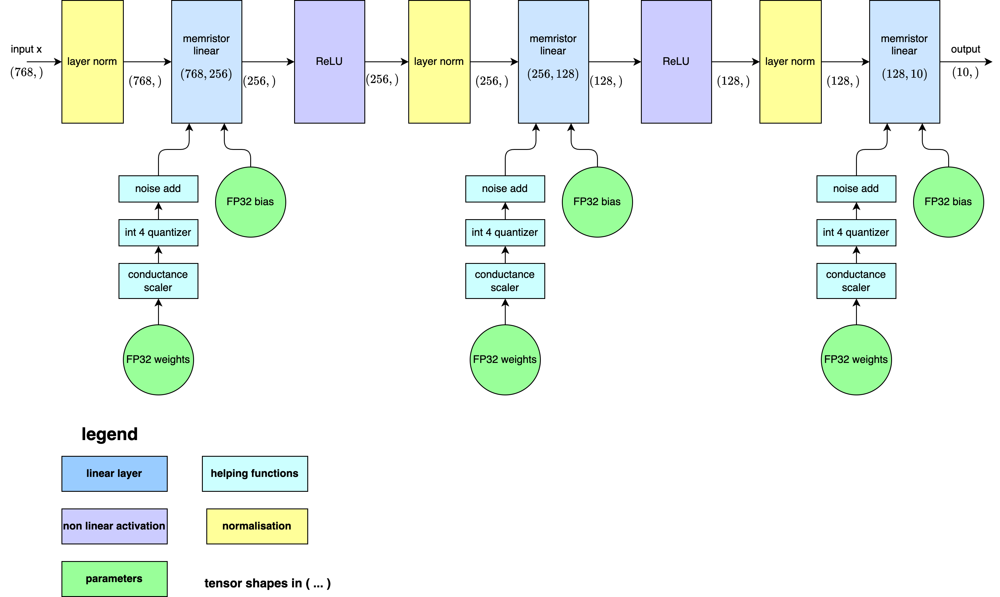

## Result plots

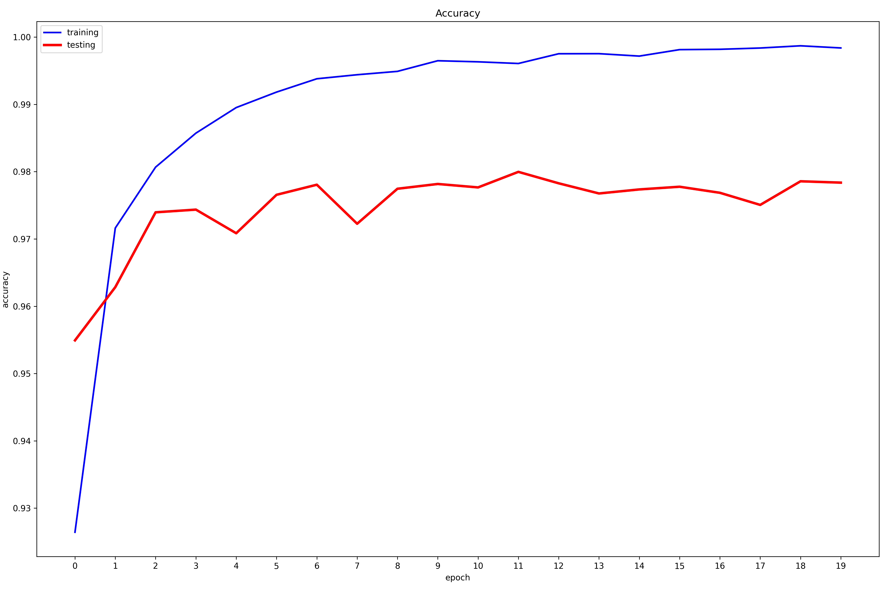

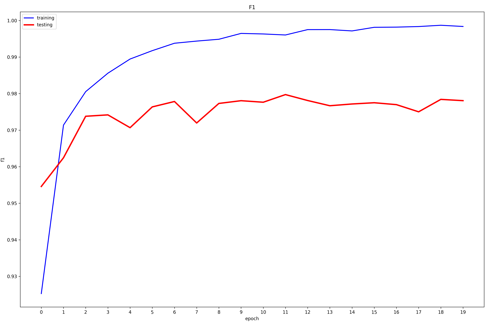

## Weights distribution

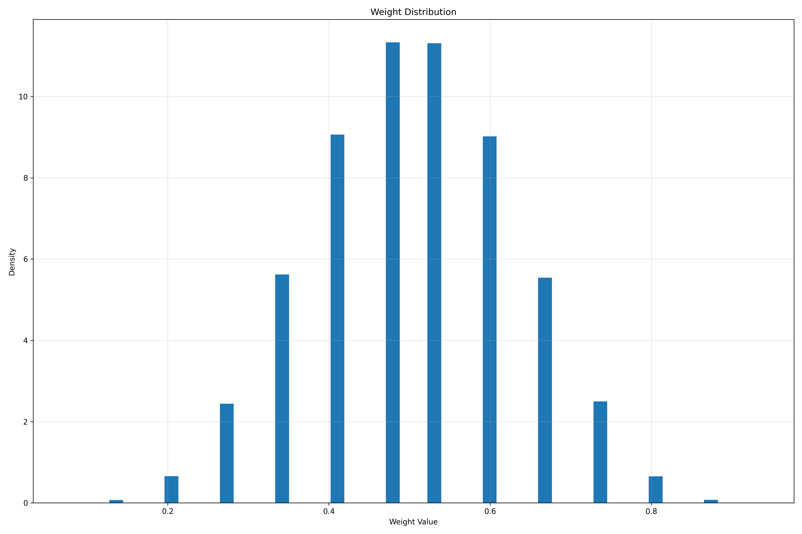

# Model comparison

