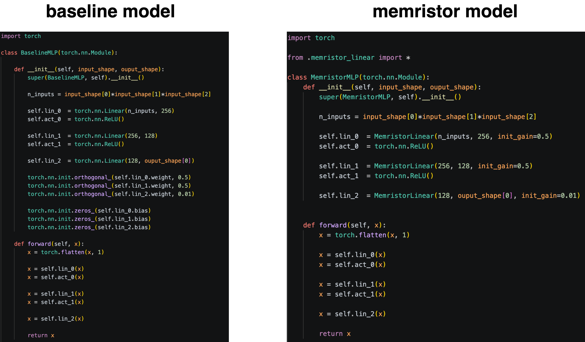
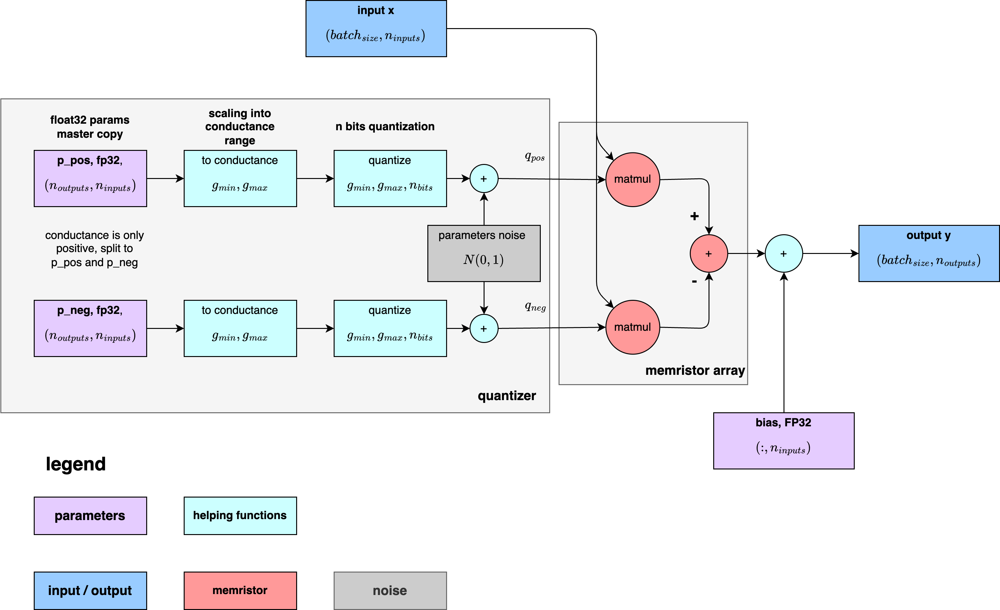
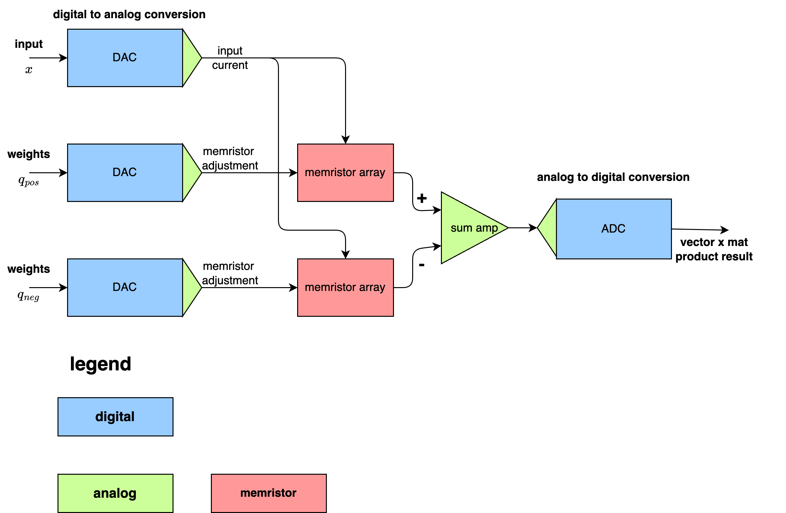

# Memristor neural network experiments


## memristor linear layer model




- **quantization aware training**
- params are stored as **fp32 master copy**
- two **differential params sets**, p_pos, p_neg : conductance is only positive
- scaled to **allowed conductance range**
- quantized to **given number of bits**
- **gaussian noise** (every forward pass new noise is generated)
- q_pos, q_neg are loaded into memristor array
- **matmul can be realised in memristive array**
- bias as fp32 is added

### quantization scheme block diagram for matrix multiplication (linear layer)




### detailed hardware idea




### pytorch code for memristor linear layer

code for pytorch memristor linear layer :  [memristor_linear.py](./src/model/memristor_linear.py)

**MLP memristive model example**

```python
import torch

from .memristor_linear import *

class MemristorMLP(torch.nn.Module):
    def __init__(self, input_shape, ouput_shape):
        super(MemristorMLP, self).__init__()

        n_inputs = input_shape[0]*input_shape[1]*input_shape[2]

        self.lin_0  = MemristorLinear(n_inputs, 256, init_gain=0.5)
        self.act_0  = torch.nn.ReLU()

        self.lin_1  = MemristorLinear(256, 128, init_gain=0.5)
        self.act_1  = torch.nn.ReLU()

        self.lin_2  = MemristorLinear(128, ouput_shape[0], init_gain=0.01)

        
    def forward(self, x):
        x = torch.flatten(x, 1)

        x = self.lin_0(x)
        x = self.act_0(x)

        x = self.lin_1(x)
        x = self.act_1(x)

        x = self.lin_2(x)
        
        return x
```


## run training     
```
cd src/
python3 main.py
```

## plotting results

```
cd src/
python3 plot_results.py
```

## experiments

- trained on MNIST dataset
- 20 epoch
- 2 hidden layers, 1 output layer, ReLU activation

**model**

```python
torch.nn.Linear(768, 256)
torch.nn.ReLU()

torch.nn.Linear(256, 128)
torch.nn.ReLU()

torch.nn.Linear(128, 10)
```

**three experiments runs**

- 1, float32 MLP baseline
- 2, memristor MLP, 4bit quantization, conductivity range (0.01, 1.0)
- 3, memristor MLP + LayerNoem, 4bit quantization, conductivity range (0.01, 1.0) with layer norm layers for better stability

**summary accuracy plot** 


### Overall Performance Summary

| Model                     |    Accuracy |   Precision |      Recall |    F1 Score |
| ------------------------- | ----------: | ----------: | ----------: | ----------: |
| FP32 Baseline             | **0.98067** | **0.98049** | **0.98073** | **0.98059** |
| Memristor MLP             |     0.97867 |     0.97891 |     0.97816 |     0.97847 |
| Memristor MLP + LayerNorm |     0.97837 |     0.97804 |     0.97837 |     0.97836 |


### Per-Class F1 Comparison

| Class | FP32 Baseline |   Memristor | Memristor + LayerNorm |
| ----- | ------------: | ----------: | --------------------: |
| 0     |       0.98719 | **0.99015** |               0.98804 |
| 1     |   **0.99146** |     0.98689 |               0.99043 |
| 2     |   **0.98018** |     0.97599 |           **0.98466** |
| 3     |   **0.98090** |     0.97993 |               0.97782 |
| 4     |       0.97518 | **0.97990** |               0.9742  |
| 5     |   **0.98247** |     0.97212 |               0.97651 |
| 6     |   **0.98160** |     0.97955 |               0.97581 |
| 7     |   **0.97655** |     0.97735 |               0.97209 |
| 8     |   **0.97366** |     0.97204 |               0.97444 |
| 9     |   **0.97670** |     0.97079 |               0.9667  |


### Accuracy Difference Relative to FP32 Baseline

| Model                     | Accuracy Drop |
| ------------------------- | ------------: |
| Memristor MLP             |      -0.00200 |
| Memristor MLP + LayerNorm |      -0.00230 |


### Full detailed results
**for full results see [Link to FULL results](doc/results/results.md)**

## results example

### 4 bits quantized weights distribution 

- weights have only given num of quantization steps (here 4 bits, 16 possible values)
- weights are in desired conductance range (here from 0.01 to 1.0)


### accuracy


# discussion

The FP32 baseline achieved the highest overall performance with an F1 score of **0.98059**. Replacing conventional linear layers with memristor-based layers resulted in only a **small degradation in performance**, demonstrating that the proposed memristor simulation preserves most of the classification capability despite hardware-inspired constraints such as:

- finite conductance range,
- low-bit quantization,
- differential weight representation,
- and device variability noise.

The basic memristor model achieved an F1 score of 0.97847, corresponding to **only a 0.2% absolute accuracy reduction** relative to the FP32 baseline.
Adding Layer Normalization slightly improved overall accuracy compared to the basic memristor model:

Model	   , Accuracy

Memristor	0.97867

Memristor + LayerNorm	0.97837

This suggests that LayerNorm helps stabilize activations under quantization and device noise, although the improvement is modest. 

Overall, the experiments show that quantization-aware training combined with differential memristor conductance modeling can achieve performance close to full-precision neural networks while incorporating realistic non-ideal hardware effects.